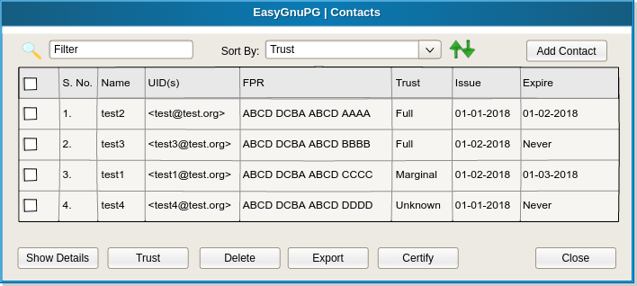
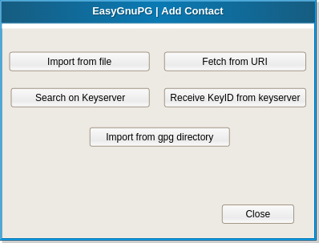

## Describing the application GGPG

### 01. On start check for valid key

  - When application starts, it should check for an existing valid
    key.  If no valid key exists, it should display a dialog box like
    this:

    

### 02. Check for key expiration

  - When application starts and there is a valid key, it should check
    also for the expiration of the key. If key expires in less than 1
    month it should give a warning and offer to renew it:

    

  - If the key has already expired, the user should be promted to
    renew or delete it:

    

### 03. Main window

  - When the application starts and the key is Ok, it displays the main
    window, which looks like this:

    

  - **Sign a file**::
    When the button is clicked, the application does these steps:
     + Open the dialog box for selecting a file.
     + After a file is selected displays a form with metadata about
       the file, like timestamp, title, description, comments, etc.
       This information will be signed together with the file, and
       will be saved together with the signature.
     + When the file is signed, displays an information/confirmation
       window, and then returns to the main window.

    

  - **Verify a signature**:
    When the button is clicked, the app does these:
     + Open the dialog box for selecting a file (of type .signature).
     
     
     
     + Verify the signature.
     
     
     + Display any error or information messages (whether the
       signature is correct or not, if correct by whom was signed, any
       metadata, etc.)
       
     
       
     + If the person who signed the docs is not on the contact list,
       it should ask to search for him online. If found, should ask
       to save him on the contact list.
       
     
     
  - **Seal a file**::
    + Open a dialog box for selecting a file
    + If the encryption is successful display a info. 
    + If unsuccessful display the errors
    
  - **Open a Sealed file(s)**::
    + Open a dialog box for selecting a file (of type .sealed)
    
    + Try decrypting the file
    
    + If successful display info (such as signature).
      - we can also give an option to launch the file with default program
    
    + If unsuccessful display an error
  
  - **Manage Contacts**::
    
    
    
